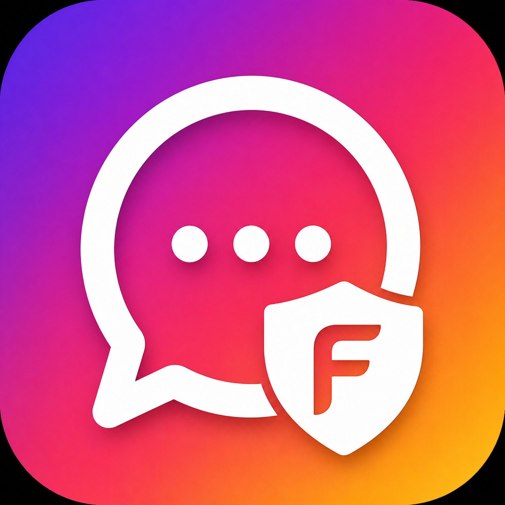

<p align="center">
  
</p>

<h1 align="center">FocusGram</h1>

<p align="center">
  A minimal Instagram Direct Messages wrapper designed to reduce distraction.
</p>

<p align="center">
  MVP Preview · Built by <a href="https://github.com/hbx1-bx1">HBX1-BX1</a>
</p>

## Status

FocusGram is currently an **MVP Preview**. It is usable for testing and personal use, but it is not production-ready.

## What it does

FocusGram strips Instagram down to just Direct Messages. No Reels, no Explore, no Stories, no Posts, no Profiles. Only your conversations.

The app runs Instagram Web inside a lightweight native wrapper with navigation restrictions and DOM-level cleanup to enforce the DM-only environment.

## Platform support

| Platform | Architecture | Format | Status |
|---|---|---|---|
| macOS | arm64 | DMG | Available |
| Windows | x64 | EXE (NSIS) | Available |
| Linux | x64 | AppImage | Available |
| Linux | arm64 | AppImage | Available |
| Android | universal debug APK | APK | Available |

## Download table

| File | Platform |
|---|---|
| FocusGram-Windows-x64-1.0.0.exe | Windows x64 |
| FocusGram-macOS-arm64-1.0.0.dmg | macOS arm64 |
| FocusGram-Linux-x64-1.0.0.AppImage | Linux x64 |
| FocusGram-Linux-arm64-1.0.0.AppImage | Linux arm64 |
| FocusGram-Android-MVP-debug-1.0.0.apk | Android MVP debug APK |

All downloads are available from the latest GitHub Release:

[Download FocusGram from GitHub Releases](https://github.com/hbx1-bx1/FocusGram/releases/latest)

### Direct download commands

**Android APK:**
```bash
curl -L -o FocusGram-Android-MVP-debug-1.0.0.apk https://github.com/hbx1-bx1/FocusGram/releases/latest/download/FocusGram-Android-MVP-debug-1.0.0.apk
```

**macOS:**
```bash
curl -L -o FocusGram-macOS-arm64-1.0.0.dmg https://github.com/hbx1-bx1/FocusGram/releases/latest/download/FocusGram-macOS-arm64-1.0.0.dmg
```

**Windows (PowerShell):**
```powershell
Invoke-WebRequest -Uri "https://github.com/hbx1-bx1/FocusGram/releases/latest/download/FocusGram-Windows-x64-1.0.0.exe" -OutFile "FocusGram-Windows-x64-1.0.0.exe"
```

**Linux x64:**
```bash
curl -L -o FocusGram-Linux-x64-1.0.0.AppImage https://github.com/hbx1-bx1/FocusGram/releases/latest/download/FocusGram-Linux-x64-1.0.0.AppImage
chmod +x FocusGram-Linux-x64-1.0.0.AppImage
./FocusGram-Linux-x64-1.0.0.AppImage
```

**Linux arm64:**
```bash
curl -L -o FocusGram-Linux-arm64-1.0.0.AppImage https://github.com/hbx1-bx1/FocusGram/releases/latest/download/FocusGram-Linux-arm64-1.0.0.AppImage
chmod +x FocusGram-Linux-arm64-1.0.0.AppImage
./FocusGram-Linux-arm64-1.0.0.AppImage
```

## Android

The Android version is an MVP with strict restrictions:

- Direct Messages only
- Text-focused interface
- No calls
- No Reels
- No Stories
- No Explore
- No Posts
- No Profiles
- No audio or video media
- Most images are intentionally blocked to reduce distraction
- F-Droid release is planned

Settings are accessed via long-press and include Reload, Find in Page, and Clear Session.

## Desktop

The Desktop version has a broader scope built on Electron:

- Direct Messages with full chat functionality
- Calls are supported (voice and video) within the same Electron session
- Keyboard shortcut Cmd/Ctrl+S opens a Tools dialog with Reload, Find in Page, Clear Session, Open Downloads Folder, and Copy Current URL
- The Tools dialog also supports in-page text search with result count
- macOS, Windows, and Linux builds are all available

## Build from source

```bash
# Desktop
cd desktop
npm install --foreground-scripts
npm run dev

# Build macOS
npm run build:mac

# Build Windows x64
npm run build:win -- --x64

# Build Linux x64
npm run build:linux -- --x64

# Build Linux arm64
npm run build:linux

# Android debug APK
cd android/FocusGramAndroid
./gradlew assembleDebug
```

## Release files

Pre-built release files are available for direct download from GitHub Releases:

- FocusGram-Windows-x64-1.0.0.exe
- FocusGram-macOS-arm64-1.0.0.dmg
- FocusGram-Linux-x64-1.0.0.AppImage
- FocusGram-Linux-arm64-1.0.0.AppImage
- FocusGram-Android-MVP-debug-1.0.0.apk

## Search keywords

FocusGram may be useful for people looking for an Instagram DM-only wrapper, a distraction-free Instagram desktop app, or a way to reduce Reels, Explore, Stories, and feed exposure while keeping Direct Messages accessible.

## Security warnings

- macOS build is unsigned and may show a Gatekeeper warning.
- Windows build is unsigned and may show a SmartScreen warning.
- Android APK installed outside Google Play may show a security warning.
- These warnings are expected for an unsigned MVP build.

## Privacy

- FocusGram does not collect, store, or transmit any user data.
- Authentication and login happen inside Instagram Web, not through any custom client.
- The app functions as a local native wrapper around Instagram Web with no server-side component.
- FocusGram does not add analytics, telemetry, or tracking. Instagram Web may still make its own network requests as part of the normal Instagram service.

## Disclaimer

FocusGram is not affiliated with Instagram, Meta, Facebook, or WhatsApp. Instagram is a trademark of its respective owner.
